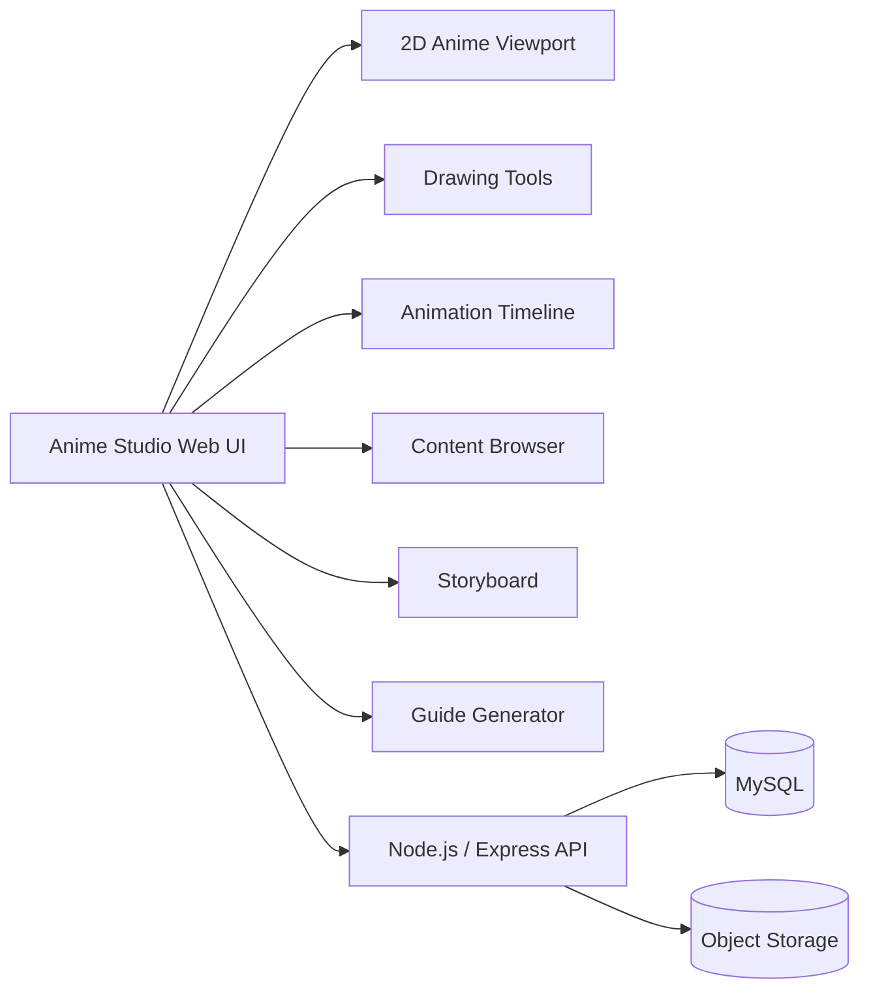
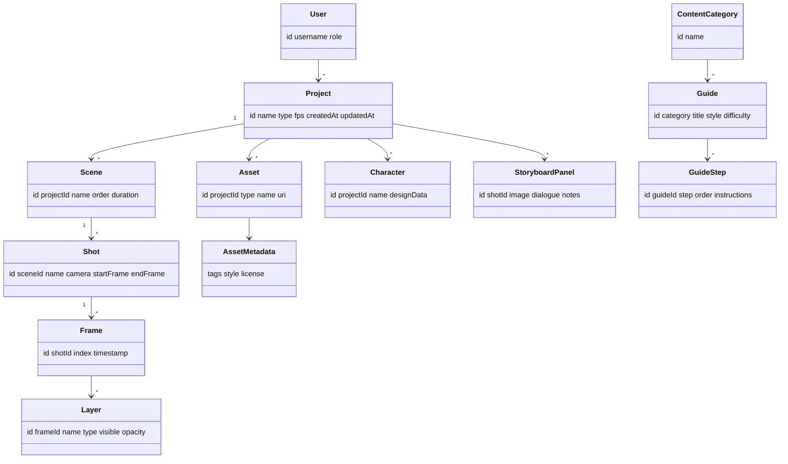
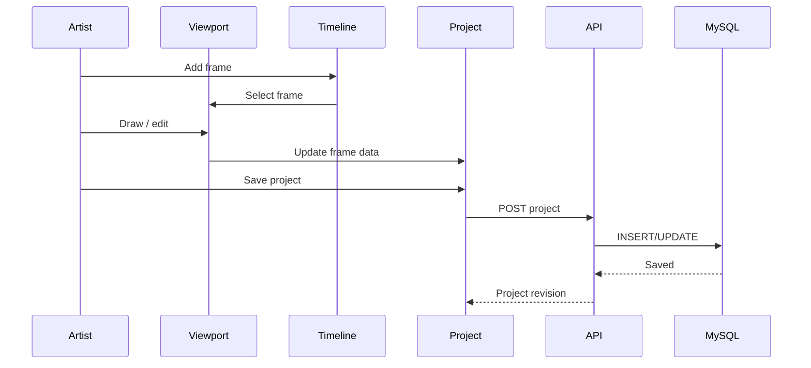
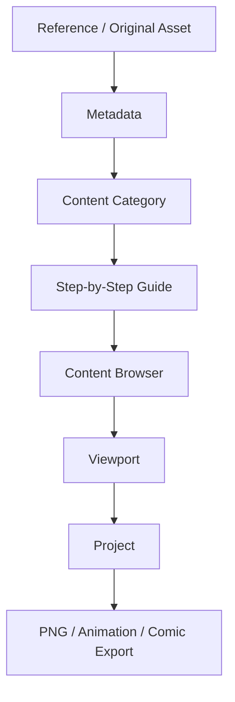
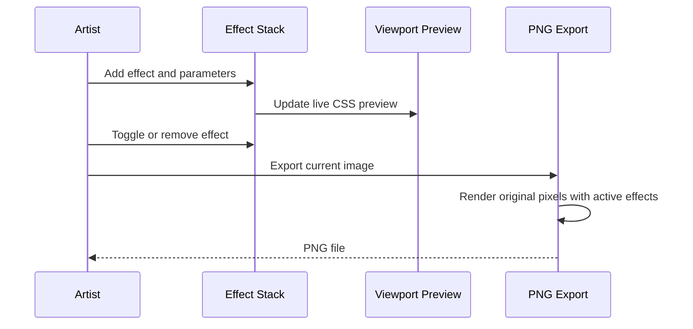

# Anime Studio UML

## Component Diagram

```mermaid
flowchart LR
  UI[Anime Studio Web UI]
  VP[2D Anime Viewport]
  TOOLS[Drawing Tools]
  TL[Animation Timeline]
  CB[Content Browser]
  SB[Storyboard]
  GEN[Guide Generator]
  API[Node.js / Express API]
  DB[(MySQL)]
  OBJ[(Object Storage)]

  UI --> VP
  UI --> TOOLS
  UI --> TL
  UI --> CB
  UI --> SB
  UI --> GEN
  UI --> API
  API --> DB
  API --> OBJ
```

## Core Class Diagram

```mermaid
classDiagram
  Project "1" --> "*" Scene
  Scene "1" --> "*" Shot
  Shot "1" --> "*" Frame
  Project --> "*" Asset
  Project --> "*" Character
  Project --> "*" StoryboardPanel
  Frame --> "*" Layer
  Asset --> AssetMetadata
  Guide --> "*" GuideStep
  ContentCategory --> "*" Guide
  User --> "*" Project

  class Project { id name type fps createdAt updatedAt }
  class Scene { id projectId name order duration }
  class Shot { id sceneId name camera startFrame endFrame }
  class Frame { id shotId index timestamp }
  class Layer { id frameId name type visible opacity }
  class Asset { id projectId type name uri }
  class AssetMetadata { tags style license }
  class Character { id projectId name designData }
  class StoryboardPanel { id shotId image dialogue notes }
  class Guide { id category title style difficulty }
  class GuideStep { id guideId step order instructions }
  class ContentCategory { id name }
  class User { id username role }
```

## Animation Sequence

```mermaid
sequenceDiagram
  participant U as Artist
  participant V as Viewport
  participant T as Timeline
  participant P as Project
  participant A as API
  participant D as MySQL

  U->>T: Add frame
  T->>V: Select frame
  U->>V: Draw / edit
  V->>P: Update frame data
  U->>P: Save project
  P->>A: POST project
  A->>D: INSERT/UPDATE
  D-->>A: Saved
  A-->>P: Project revision
```

## Asset/Guide Pipeline

```mermaid
flowchart TD
  SRC[Reference / Original Asset] --> META[Metadata]
  META --> CAT[Content Category]
  CAT --> GUIDE[Step-by-Step Guide]
  GUIDE --> BROWSER[Content Browser]
  BROWSER --> VIEW[Viewport]
  VIEW --> PROJECT[Project]
  PROJECT --> EXPORT[PNG / Animation / Comic Export]
```

## Image Effects Sequence

```mermaid
sequenceDiagram
  participant Artist
  participant FX as Effect Stack
  participant View as Viewport Preview
  participant Export as PNG Export
  Artist->>FX: Add effect and parameters
  FX->>View: Update live CSS preview
  Artist->>FX: Toggle or remove effect
  Artist->>Export: Export current image
  Export->>Export: Render original pixels with active effects
  Export-->>Artist: PNG file
```
